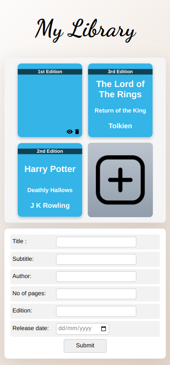
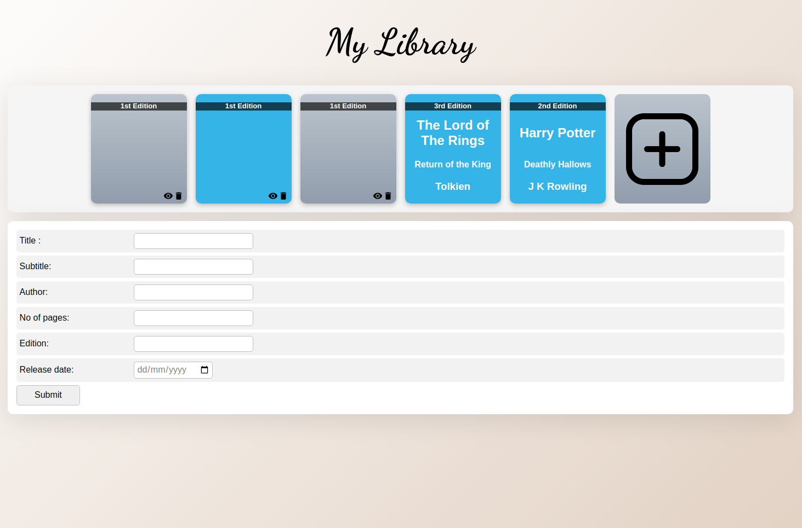

# my-library
A basic library app to store and manage your books.

### Links

- Live Site URL: [Live Preview](https://peppy-malasada-cceb6f.netlify.app/)

### Screenshots

### Built with

- HTML
- CSS
- Javascript

### What I learned

- My main objective behind building this project was to practise the fundamentals of **Object oriented programming** and how they can be implemented in Javascript, especially **prototypal inheritence**. 

- I also learned how the **new** keyword works under the hood.

- Instead of defining the methods related to "book" objects on the contructor function itself, I defined them on the object referenced by - Book.prototype property. These methods were then **inherited** when the JS interpreter couldn't find them on the book objects themselves, because every book object was an instance of Book() constructor function.
